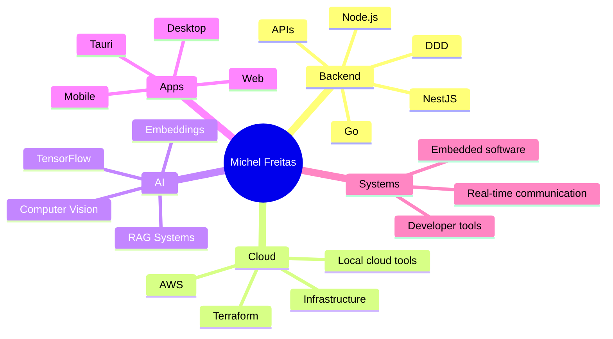

<div align="center">
  
</div>

<br />

<div align="center">
  <a href="https://michelfreitas.com">
    
  </a>
  <a href="mailto:contato@michelfreitas.com">
    
  </a>
  <a href="https://github.com/michasdev">
    
  </a>
</div>

---

## 👋 About me

I'm **Michel Freitas**, an **18-year-old Software Engineer at R2 Ventures**, based in São Paulo, Brazil.

I started programming when I was 12 and have been building real-world products ever since — from full-stack platforms and internal enterprise systems to AI-powered applications, embedded software, cloud tools and desktop apps.

Currently, I work mainly with **Go, Node.js, NestJS, AWS and Terraform**, with a strong focus on backend engineering, cloud infrastructure, data/AI systems and scalable software architecture.

```ts
const michel = {
  age: 18,
  role: "Software Engineer",
  company: "R2 Ventures",
  location: "São Paulo, Brazil",
  mainStack: ["Go", "Node.js", "NestJS", "AWS", "Terraform"],
  interests: [
    "Backend Engineering",
    "Cloud Infrastructure",
    "Artificial Intelligence",
    "Distributed Systems",
    "Developer Tools",
    "Desktop Apps",
  ],
  currentlyBuilding: ["MildStack", "Flyra", "Cloud-native tools"],
};
```

---

## 🚀 Main stack

<div align="center">

### Languages


### Backend, Cloud & Infrastructure


### Frontend & Apps


### Tools


</div>

---

## 🧠 Featured projects

### 🔥 Flyra — AI-powered wildfire detection with drones

**Flyra** is a complete system using drones equipped with artificial intelligence to detect and help prevent wildfires.

I worked across the entire product: AI training, embedded systems, backend, desktop/mobile applications, real-time drone integration and team management during the final technical school project.

**Website:** [flyra.michelfreitas.com](https://flyra.michelfreitas.com)

#### What I built

* AI model for fire detection
* Local embedded server running on a Raspberry Pi
* Central backend for teams, users, drones and organizations
* Real-time drone camera and sensor data transmission
* Desktop/mobile app for monitoring, reports and alerts
* Project architecture, development coordination and team management

#### Tech stack


#### Repositories

| Repository                                                                | Description                                                                                                                                                            |
| ------------------------------------------------------------------------- | ---------------------------------------------------------------------------------------------------------------------------------------------------------------------- |
| [flyra-local-server](https://github.com/michasdev/flyra-local-server)     | Local server running on a Raspberry Pi. Executes the AI model, collects drone sensor data, streams video and sends information to the central backend.                 |
| [flyra-central-server](https://github.com/michasdev/flyra-central-server) | Central backend responsible for teams, users, drones, organizations and more. Built with DDD, NestJS, TypeScript and Prisma.                                           |
| [flyra-desktop-tauri](https://github.com/michasdev/flyra-desktop-tauri)   | Multiplatform app built with Tauri + Rust, with support for desktop, mobile and web. Used for real-time camera visualization, drone communication, reports and alerts. |

---

### ☁️ MildStack — Local AWS emulator built in Go

**MildStack** is a free, lightweight and open-source alternative to LocalStack.

The idea is simple: run your own AWS-like environment locally with a fast, native Go runtime — without Docker, without cloud accounts and without heavy setup.

**Website:** [mildstack.dev](https://mildstack.dev)
**Repository:** [github.com/michasdev/mildstack](https://github.com/michasdev/mildstack)

#### Highlights

* 100% Go-based core
* No Docker required
* CLI for running local cloud services
* Desktop app for browsing and managing resources
* Resource Browser for local AWS-like services
* Built to be lightweight, fast and developer-friendly

#### Supported / planned services

* S3
* DynamoDB
* SQS
* SNS
* Lambda
* EventBridge
* CloudWatch Logs
* And more

#### Tech stack


---

## 📌 Other projects and experience

* **eFocus** — robust e-commerce platform for textile sales, built with Next.js and TypeScript.
* **RAG System with AI** — semantic search and AI-powered fabric recommendation system using NestJS, TypeScript, LangChain, Ollama and MongoDB Vector Search.
* **Internal enterprise systems** — development and maintenance of full-stack systems, APIs, CI/CD pipelines and integrations.
* **Freitas UI** — experimental React component library focused on modern, animated and editable components.

---

## 📊 GitHub stats

<div align="center">


<br />


<br />


<br />


</div>

---

## 🧩 What I like to build



---

## 🛠️ Current focus

* Building cloud and infrastructure tools
* Improving my Go and AWS ecosystem knowledge
* Creating high-performance backend systems
* Exploring AI applied to real-world products
* Developing tools that make developers faster

---

## 🌎 Connect with me

<div align="center">

<a href="https://michelfreitas.com">
  
</a>
<a href="mailto:contato@michelfreitas.com">
  
</a>
<a href="https://github.com/michasdev">
  
</a>

</div>

<br />

<div align="center">
  <strong>Building software that connects AI, cloud, infrastructure and real-world products.</strong>
</div>


```
